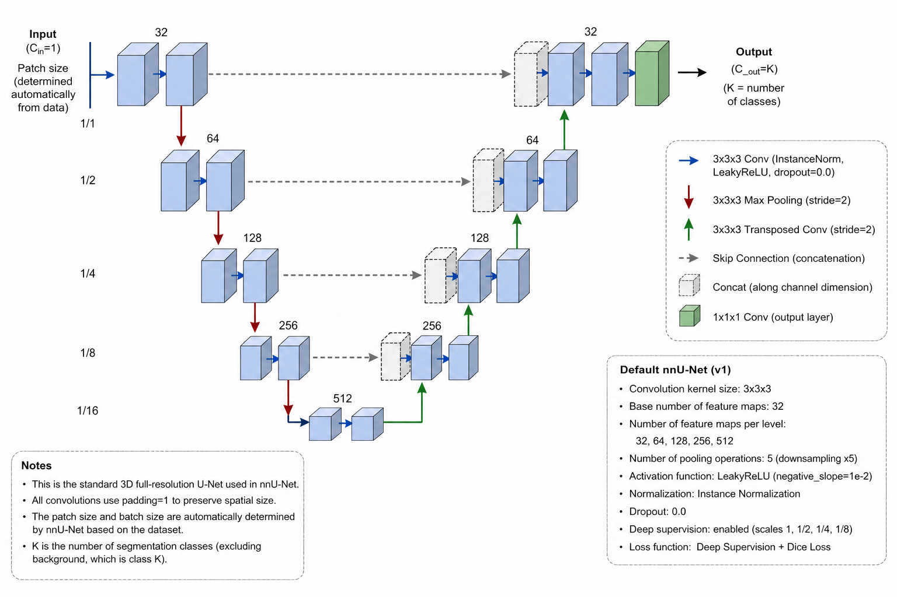

# Hepatic Vessel Map (HVM): CT Dataset for Liver Vascular and Tumor Segmentation

Pretrained segmentation models and inference code for hepatic portal vein, hepatic vein, and liver tumor segmentation.

This repository releases the automatic segmentation pipeline based on nnU-Net V2, providing precise voxel-wise segmentation of hepatic vascular structures and liver tumors.

---

## Highlights

Based on the nnU-Net framework, we developed three distinct segmentation models—specifically designed for segmenting the hepatic veins, portal veins, and liver tumors.

1. Hepatic Vein - Accurate segmentation of right, middle, and left hepatic veins up to third-order branches
2. Portal Vein - Automatic segmentation of main portal vein and left/right branches up to third-order ramifications
3. Liver Tumor - Automatic detection and segmentation of hepatic masses

These models are trained and validated on the HVM (Hepatic Vessel Map) Dataset, a comprehensive clinical dataset designed for liver vascular segmentation and surgical planning.

---

## Model Architecture Diagram



---

## Background

Precise delineation of hepatic and portal venous anatomy is crucial for the diagnosis of liver disease, surgical planning, and prognosis prediction. Current three-dimensional visualization of these complex vascular structures relies on manual or semi-automated CT segmentation, which is time-consuming and operator-dependent. Although artificial intelligence (AI) presents a promising alternative, existing methods remain constrained by the scarcity of publicly available datasets with fine-grained vascular annotations.

---

## Pre-trained Models

All trained models are released on Hugging Face:

🔗 https://huggingface.co/Xunqi/nnunet_segment_model/tree/main

| Task | Configuration | Modality |
|------|---------------|----------|
| Portal_vein_segment | `3d_fullres` | CT |
| Hepatic_vein_segment | `3d_fullres` | CT |
| Liver_tumor_segment | `3d_fullres` | CT |

To use a pre-trained model:

1. Download the model from the link above
2. Install it using:
```bash
nnUNetv2_install_pretrained_model_from_zip path/to/downloaded_model.zip
```

---

## Installation

```bash
conda create -n nnunet python=3.10 -y
conda activate nnunet
pip install torch --index-url https://download.pytorch.org/whl/cu121
pip install -e .
```

Set the three nnU-Net environment variables:

```bash
export nnUNet_raw=/path/to/nnUNet_raw
export nnUNet_preprocessed=/path/to/nnUNet_preprocessed
export nnUNet_results=/path/to/nnUNet_results
```

---

## Inference with Pretrained Models

```bash
# 1) Download the desired model from Hugging Face and unzip into $nnUNet_results
# 2) Run prediction:
nnUNetv2_predict \
    -i  /path/to/input_nifti \
    -o  /path/to/output \
    -d  <DatasetID> \
    -c  3d_fullres \
    -f  all
```

---

## Reproducing Training from Scratch

Data must follow the nnU-Net v2 format:

```bash
nnUNetv2_plan_and_preprocess -d <DatasetID> --verify_dataset_integrity
nnUNetv2_train <DatasetID> 3d_fullres <fold>
```

---

## HVM Dataset (Companion Dataset)

The annotated dataset used to train these models includes:

| Item | Description |
|------|-------------|
| Imaging modality | Portal Venous Phase (PVP) contrast-enhanced CT |
| Number of cases | 282 patients from two medical centers |
| Number of slices | Over 41,400 slices |
| Annotated structures | Hepatic veins, portal veins (to third-order branches), liver tumors |

---

## Ground-Truth Annotation Protocol

Ground-truth labels in our dataset were produced through a rigorous semi-automatic pipeline:

Step 1: Initial Segmentation
A radiologist with 5 years of experience in abdominal imaging performed the initial manual segmentation for all cases using ITK-SNAP software (version 3.8.0).

Step 2: AI-Assisted Annotation**
For hepatic veins and portal veins:
- Initial ground truth from 40 cases was used to train two dedicated 3D-UNet models
- The trained models generated preliminary segmentation masks for remaining 242 cases
- The junior radiologist manually corrected these AI-generated masks

Step 3: Quality Control and Final Validation**
A senior abdominal radiologist with more than 15 years of expertise reviewed all segmentations, corrected any inaccuracies, and provided final validation.

Annotation Scope:
- Hepatic veins: right, middle, and left hepatic veins, including all visible tributaries up to third-order branches
- Portal veins: main portal vein, left and right portal veins up to third branch of ramification
- Liver tumors: complete boundary delineation

---

## Data Records

The HVM Dataset is publicly accessible via Zenodo:

🔗 https://zenodo.org/records/17863696

Dataset structure:
```
HVM Dataset/
├── Center 1/
│   ├── Image/                           # PVP CT scans (NIfTI format)
│   ├── Annotation_Hepatic veins/        # Hepatic vein segmentations
│   ├── Annotation_Portal veins/         # Portal vein segmentations
│   ├── Annotation_Liver tumors/         # Liver tumor segmentations
│   └── Center_1_Clinicopathological data.xlsx
└── Center 2/
    ├── Image/
    ├── Annotation_Hepatic veins/
    ├── Annotation_Portal veins/
    ├── Annotation_Liver tumors/
    └── Center_2_Clinicopathological data.xlsx
```

---

## Technical Validation

Image Quality Control:
- Each CT scan underwent a two-stage quality assessment
- Subject eligibility confirmed based on predefined inclusion criteria
- Visual inspection by a radiologist with over 15 years of experience to confirm absence of significant artifacts and verify adequate vascular contrast

Annotation Quality Control:
- Multi-step protocol combining manual expertise and AI-assisted refinement
- Consensus-based ground truth established through two-tier review process

---

## Project Structure

```
nnunet/
├── nnunetv2/
│   ├── experiment_planning/    # Dataset fingerprinting and planning
│   ├── inference/              # Inference and prediction modules
│   ├── model_sharing/          # Model download/export utilities
│   ├── paths.py                # Path configuration
│   ├── postprocessing/         # Post-processing utilities
│   ├── run/                    # Training entry points
│   ├── training/               # Training logic and trainers
│   │   ├── data_augmentation/  # Data augmentation transforms
│   │   ├── dataloading/        # Data loading utilities
│   │   ├── loss/               # Loss functions
│   │   ├── lr_scheduler/       # Learning rate schedulers
│   │   └── nnUNetTrainer/      # Trainer implementations
│   └── utilities/              # Utility functions
├── documentation/              # Documentation and examples
├── pyproject.toml              # Project configuration
└── setup.py                    # Setup script
```

---

## License

- The nnU-Net framework code retains its original Apache-2.0 license.
- Our released model weights and dataset are distributed under CC-BY license.

---

## Citation

---

## Acknowledgments

This project is based on the nnU-Net framework developed by the Division of Medical Image Computing at the German Cancer Research Center (DKFZ), Heidelberg, Germany. We thank Fabian Isensee and the DKFZ team for releasing nnU-Net.

We extend our sincere gratitude to the radiologists who provided high-quality ground truth annotations for hepatic veins, portal veins, and liver tumors. Their expertise and meticulous manual delineations form the foundation of the accurate segmentation models in this project.

Data Source:
- Center 1: Guangdong Provincial People's Hospital, Guangdong Academy of Medical Sciences
- Center 2: Guangxi Medical University Cancer Hospital

Funding:
This study was supported by the Shenzhen Science and Technology Innovation Program (Grant No. JCYJ20250604183707010), the Shenzhen Medical Research Special Fund Project (Grant No. C2501020), and the Guangdong Medical Science and Technology Research Foundation Program (Grant No. 2025262).
